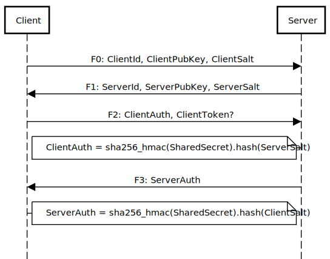

## Authentication (TCP or Websocket)

[Handshake Messages](../handshake/handshake-message.md)

<!--
https://sequencediagram.org
Client->Server: F0: ClientId, ClientPubKey, ClientSalt
Server->Client: F1: ServerId, ServerPubKey, ServerSalt
Client->Server: F2: ClientAuth, ClientToken?
note left of Server: ClientAuth = sha256_hmac(SharedSecret).hash(ServerSalt)
Server->Client: F3: ServerAuth
note right of Client: SlientAuth = sha256_hmac(SharedSecret).hash(CerverSalt)
-->

#### ClientToken validation *

An optional token can be specified during handshake (message F2).

The default token validation in C++ edge broker uses the [same algorithm as dsa v1](../broker/edge-broker/tokens.md)

## Authorization

#### Permission Roles

Each dslink is assciated with a permission role, or comma separated multiple roles. all roles must be explictly defined for the clients.
unlike v1, in which dslink might inherite other permisison Group automaticly, like the group `trustedLinks` and `default`

#### Permission check * 

When dslink access a node, [broker checks all the rules associated with its permission role](../broker/edge-broker/permissions.md), and return the permission level. When multiple rules match, it uses the one with more specific path or longer path.
If there is no matching rule, broker then check the fallback role if exists and continue the fallback chain.

#### Cross broker permission

permisison roles are limited to the scope of current broker, there are 2 ways to achieve permission checking cross multiple broker

1. Combine permission of broker and the dslink
  * Broker first check the permission locally, if dslink get enough permission level for the operation, it forward the request to downstream and downstream will do another check with the current broker's role on that downstream broker.
  * If broker is not sure if the permissio level is enough, it add a `Max Permission` header when forwaring the request so the downstream wont allow the dslink to use anything higher than that permission level even when the current broker is allowed to.  
2. Use `Permission Token` header
  * When multiple brokers are in the same authorization network, like Oauth. A permission token header can be used to request
  * Each broker will check the permission token header and the make the decision whether to allow it, block it, or pass through the request and let downstream make decision.
  * For list and subscribe requests with permission token, a preflight request will be sent to downstream first to check the permission before a real stream is created. This way requests on same node can be merged into one stream.
  * dslink and broker should block all requests with permission token they can't understand.
 

### Notes
* Things marked with * can be implemented differently in modules
* List of features mentioned in this doc, but not planed to implement in the default c++ edge broker yet. these feature can be implemented in modules
  * multiple roles for one dslink
  * forward `Permission Token` header to downstream/upstream
